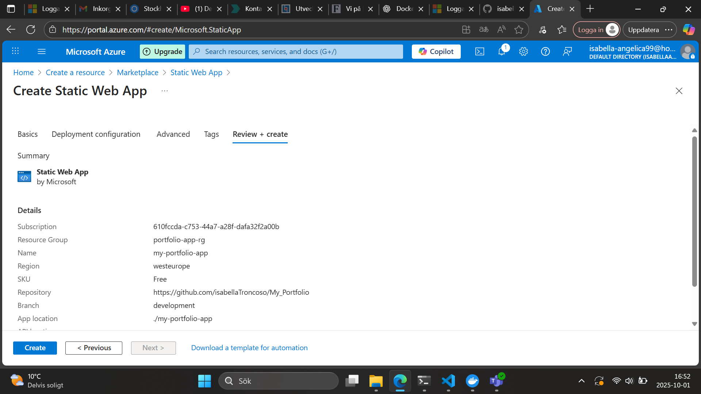

 Isabella Troncoso – Portfolio

Detta är mitt portfolio-projekt byggt i Angular och deployat i Azure Static Web Apps. Projektet visar mina tekniska kunskaper, projekt och erfarenheter på ett modernt sätt.

------------------------------------------------------------------------------------------
 
Syfte

Syftet med projektet är att:

- Skapa ett personligt portfolio i Angular

- Lära mig grunderna i cloud computing och Azure

- Deploya applikationen till molnet för att kunna visa den för arbetsgivare

------------------------------------------------------------------------------------------

Teknisk bakgrund

Traditionellt bygger man applikationer lokalt, men med molnet kan man:

- Skala upp eller ner resurser beroende på behov

- Betala efter användning (prismodell i Azure)

- Slippa underhålla egna servrar

Jag valde Azure Static Web Apps eftersom det är enkelt att deploya frontend-projekt och det finns en gratis tier.

------------------------------------------------------------------------------------------

Hur jag gjorde

Skapade Angular-projektet lokalt med ng new my-portfolio

Byggde en portfolio med:

- Kort beskrivning av mig själv

- Mina skol-/hobbyprojekt (GitHub-länkar)

- Lista på tekniska kunskaper

- Pushade projektet till GitHub

- Deployade via Azure Static Web App:

- Kopplade mitt GitHub-repo till Azure

- Azure byggde automatiskt Angular-appen

- Deployment blev tillgänglig via en publik URL

Här visar jag processen jag följde för att deploya min portfolio i Azure.

Steg 1:

Steg 2:

Steg 3:

Steg 4:
.png)

Min Action

LÄNKEN: 

https://polite-sea-0acb7d303.1.azurestaticapps.net

